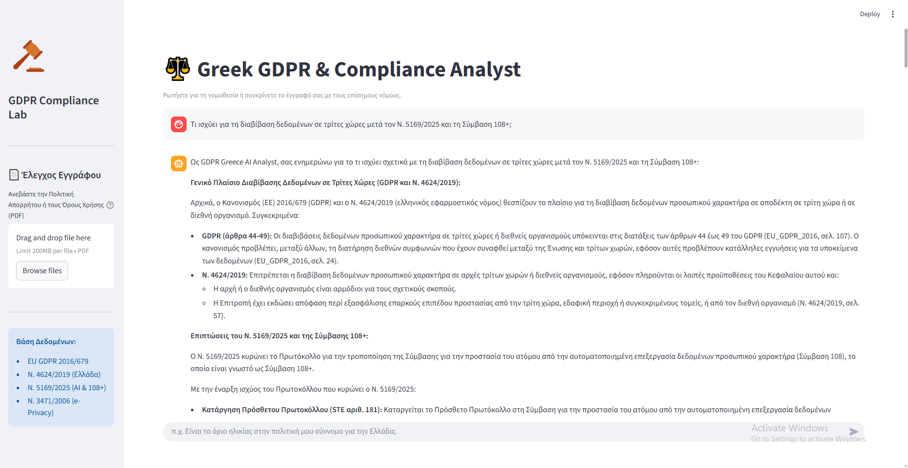
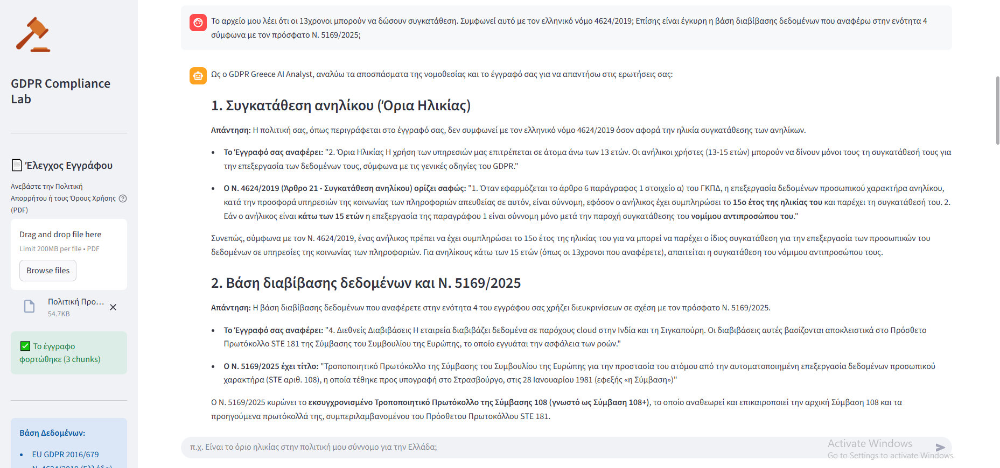
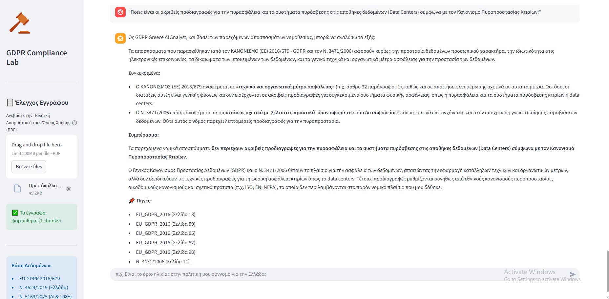
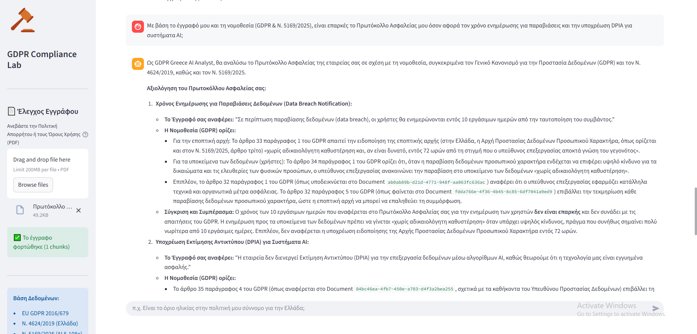

# 🧪 Σενάρια Δοκιμών (Test Scenarios)

Αυτός ο οδηγός περιέχει συγκεκριμένα σενάρια για την αξιολόγηση της ακρίβειας και της αξιοπιστίας του συστήματος RAG.

## Σενάριο 1: Ερώτηση χωρίς αρχείο
* **Αρχείο:** Κανένα
* **Ερώτηση:** "Τι ισχύει για τη διαβίβαση δεδομένων σε τρίτες χώρες μετά τον Ν. 5169/2025 και τη Σύμβαση 108+;"
* **Απάντηση:** "Ως GDPR Greece AI Analyst, σας ενημερώνω για το τι ισχύει σχετικά με τη διαβίβαση δεδομένων σε τρίτες χώρες μετά τον Ν. 5169/2025 και τη Σύμβαση 108+:

Γενικό Πλαίσιο Διαβίβασης Δεδομένων σε Τρίτες Χώρες (GDPR και Ν. 4624/2019):

Αρχικά, ο Κανονισμός (ΕΕ) 2016/679 (GDPR) και ο Ν. 4624/2019 (ελληνικός εφαρμοστικός νόμος) θεσπίζουν το πλαίσιο για τη διαβίβαση δεδομένων προσωπικού χαρακτήρα σε αποδέκτη σε τρίτη χώρα ή σε διεθνή οργανισμό. Συγκεκριμένα:

GDPR (άρθρα 44-49): Οι διαβιβάσεις δεδομένων προσωπικού χαρακτήρα σε τρίτες χώρες ή διεθνείς οργανισμούς υπόκεινται στις διατάξεις των άρθρων 44 έως 49 του GDPR (EU_GDPR_2016, σελ. 107). Ο κανονισμός προβλέπει, μεταξύ άλλων, τη διατήρηση διεθνών συμφωνιών που έχουν συναφθεί μεταξύ της Ένωσης και τρίτων χωρών, εφόσον αυτές προβλέπουν κατάλληλες εγγυήσεις για τα υποκείμενα των δεδομένων (EU_GDPR_2016, σελ. 24).
Ν. 4624/2019: Επιτρέπεται η διαβίβαση δεδομένων προσωπικού χαρακτήρα σε αρχές τρίτων χωρών ή διεθνείς οργανισμούς, εφόσον πληρούνται οι λοιπές προϋποθέσεις του Κεφαλαίου αυτού και:
Η αρχή ή ο διεθνής οργανισμός είναι αρμόδιοι για τους σχετικούς σκοπούς.
Η Επιτροπή έχει εκδώσει απόφαση περί εξασφάλισης επαρκούς επιπέδου προστασίας από την τρίτη χώρα, εδαφική περιοχή ή συγκεκριμένους τομείς, ή από τον διεθνή οργανισμό (Ν. 4624/2019, σελ. 57).
Επιπτώσεις του Ν. 5169/2025 και της Σύμβασης 108+:

Ο Ν. 5169/2025 κυρώνει το Πρωτόκολλο για την τροποποίηση της Σύμβασης για την προστασία του ατόμου από την αυτοματοποιημένη επεξεργασία δεδομένων προσωπικού χαρακτήρα (Σύμβαση 108), το οποίο είναι γνωστό ως Σύμβαση 108+.

Με την έναρξη ισχύος του Πρωτοκόλλου που κυρώνει ο Ν. 5169/2025:

Κατάργηση Πρόσθετου Πρωτοκόλλου (STE αριθ. 181): Καταργείται το Πρόσθετο Πρωτόκολλο στη Σύμβαση για την προστασία του ατόμου από την αυτοματοποιημένη επεξεργασία δεδομένων προσωπικού χαρακτήρα, όσον αφορά τις εποπτικές αρχές και τις διασυνοριακές ροές δεδομένων (STE αριθ. 181) (Ν. 5169/2025, σελ. 44).
Ενσωμάτωση διατάξεων στη νέα Σύμβαση 108+ (άρθρο 14): Το άρθρο 12 της αρχικής Σύμβασης 108 (το οποίο πλέον αποτελεί το νέο άρθρο 14) ενσωματώνει τις διατάξεις του άρθρου 2 του Πρόσθετου Πρωτοκόλλου του 2001 (STE αριθ. 181). Αυτό αφορά τις διασυνοριακές ροές δεδομένων προσωπικού χαρακτήρα προς αποδέκτη που δεν υπόκειται στη δικαιοδοσία ενός Συμβαλλόμενου Μέρους της Σύμβασης (Ν. 5169/2025, σελ. 10).
Συμπερασματικά:

Μετά τον Ν. 5169/2025 και την αναθεωρημένη Σύμβαση 108+, οι διαβιβάσεις δεδομένων σε τρίτες χώρες διέπονται από ένα πιο εκσυγχρονισμένο και ενοποιημένο πλαίσιο. Ενώ ο GDPR και ο Ν. 4624/2019 παραμένουν η κύρια νομοθεσία εντός της ΕΕ και για τους φορείς που υπάγονται σε αυτή, η Σύμβαση 108+ προσφέρει ένα συμπληρωματικό διεθνές πλαίσιο, ειδικά για χώρες-μέλη του Συμβουλίου της Ευρώπης και άλλες χώρες που προσχωρούν σε αυτή. Οι διατάξεις για τις διασυνοριακές ροές δεδομένων έχουν πλέον ενσωματωθεί απευθείας στο κύριο κείμενο της Σύμβασης 108+ (στο νέο Άρθρο 14), εξαλείφοντας την ανάγκη για το ξεχωριστό Πρόσθετο Πρωτόκολλο 181. Αυτό οδηγεί σε μεγαλύτερη σαφήνεια και επικαιροποίηση των κανόνων για τις διεθνείς διαβιβάσεις δεδομένων, λαμβάνοντας υπόψη τις σύγχρονες προκλήσεις.

📌 Πηγές:

EU_GDPR_2016 (Σελίδα 108)
EU_GDPR_2016 (Σελίδα 24)
EU_GDPR_2016 (Σελίδα 25)
Ν. 4624/2019 (Σελίδα 58)
Ν. 5169/2025 (Σελίδα 11)
Ν. 5169/2025 (Σελίδα 3)
Ν. 5169/2025 (Σελίδα 45)"

## Σενάριο 2: Διπλή ερώτηση με αρχείο 
* **Αρχείο:** `Πολιτική Προστασίας Δεδομένων - SmartBank Hellas.pdf`
* **Ερώτηση:** "Το αρχείο μου λέει ότι οι 13χρονοι μπορούν να δώσουν συγκατάθεση. Συμφωνεί αυτό με τον ελληνικό νόμο 4624/2019; Επίσης είναι έγκυρη η βάση διαβίβασης δεδομένων που αναφέρω στην ενότητα 4 σύμφωνα με τον πρόσφατο Ν. 5169/2025;" 
* **Απάντηση:** "Ως ο GDPR Greece AI Analyst, αναλύω τα αποσπάσματα της νομοθεσίας και το έγγραφό σας για να απαντήσω στις ερωτήσεις σας:

1. Συγκατάθεση ανηλίκου (Όρια Ηλικίας)
Απάντηση: Η πολιτική σας, όπως περιγράφεται στο έγγραφό σας, δεν συμφωνεί με τον ελληνικό νόμο 4624/2019 όσον αφορά την ηλικία συγκατάθεσης των ανηλίκων.

Το Έγγραφό σας αναφέρει: "2. Όρια Ηλικίας Η χρήση των υπηρεσιών μας επιτρέπεται σε άτομα άνω των 13 ετών. Οι ανήλικοι χρήστες (13-15 ετών) μπορούν να δίνουν μόνοι τους τη συγκατάθεσή τους για την επεξεργασία των δεδομένων τους, σύμφωνα με τις γενικές οδηγίες του GDPR."

Ο Ν. 4624/2019 (Άρθρο 21 - Συγκατάθεση ανηλίκου) ορίζει σαφώς: "1. Όταν εφαρμόζεται το άρθρο 6 παράγραφος 1 στοιχείο α) του ΓΚΠΔ, η επεξεργασία δεδομένων προσωπικού χαρακτήρα ανηλίκου, κατά την προσφορά υπηρεσιών της κοινωνίας των πληροφοριών απευθείας σε αυτόν, είναι σύννομη, εφόσον ο ανήλικος έχει συμπληρώσει το 15ο έτος της ηλικίας του και παρέχει τη συγκατάθεσή του. 2. Εάν ο ανήλικος είναι κάτω των 15 ετών η επεξεργασία της παραγράφου 1 είναι σύννομη μόνο μετά την παροχή συγκατάθεσης του νομίμου αντιπροσώπου του."

Συνεπώς, σύμφωνα με τον Ν. 4624/2019, ένας ανήλικος πρέπει να έχει συμπληρώσει το 15ο έτος της ηλικίας του για να μπορεί να παρέχει ο ίδιος συγκατάθεση για την επεξεργασία των προσωπικών του δεδομένων σε υπηρεσίες της κοινωνίας των πληροφοριών. Για ανηλίκους κάτω των 15 ετών (όπως οι 13χρονοι που αναφέρετε), απαιτείται η συγκατάθεση του νόμιμου αντιπροσώπου τους.

2. Βάση διαβίβασης δεδομένων και Ν. 5169/2025
Απάντηση: Η βάση διαβίβασης δεδομένων που αναφέρετε στην ενότητα 4 του εγγράφου σας χρήζει διευκρινίσεων σε σχέση με τον πρόσφατο Ν. 5169/2025.

Το Έγγραφό σας αναφέρει: "4. Διεθνείς Διαβιβάσεις Η εταιρεία διαβιβάζει δεδομένα σε παρόχους cloud στην Ινδία και τη Σιγκαπούρη. Οι διαβιβάσεις αυτές βασίζονται αποκλειστικά στο Πρόσθετο Πρωτόκολλο STE 181 της Σύμβασης του Συμβουλίου της Ευρώπης, το οποίο εγγυάται την ασφάλεια των ροών."

Ο Ν. 5169/2025 έχει τίτλο: "Τροποποιητικό Πρωτόκολλο της Σύμβασης του Συμβουλίου της Ευρώπης για την προστασία του ατόμου από την αυτοματοποιημένη επεξεργασία δεδομένων προσωπικού χαρακτήρα (STE αριθ. 108), η οποία τέθηκε προς υπογραφή στο Στρασβούργο, στις 28 Ιανουαρίου 1981 (εφεξής «η Σύμβαση»)"

Ο Ν. 5169/2025 κυρώνει το εκσυγχρονισμένο Τροποποιητικό Πρωτόκολλο της Σύμβασης 108 (γνωστό ως Σύμβαση 108+), το οποίο αναθεωρεί και επικαιροποιεί την αρχική Σύμβαση 108 και τα προηγούμενα πρωτόκολλά της, συμπεριλαμβανομένου του Πρόσθετου Πρωτοκόλλου STE 181.

Ενώ το Πρόσθετο Πρωτόκολλο STE 181 όντως αφορά τις διασυνοριακές ροές δεδομένων και τις εποπτικές αρχές, η αναφορά σας σε αυτό ως αποκλειστική βάση για διαβιβάσεις σε τρίτες χώρες (Ινδία και Σιγκαπούρη) πρέπει να εξεταστεί υπό το πρίσμα του εκσυγχρονισμένου πλαισίου της Σύμβασης 108+ που κυρώνεται με τον Ν. 5169/2025 και, κυρίως, του Γενικού Κανονισμού Προστασίας Δεδομένων (ΓΚΠΔ).

Ο ΓΚΠΔ (άρθρα 44-50) προβλέπει συγκεκριμένες βάσεις για τη διαβίβαση δεδομένων σε τρίτες χώρες, όπως αποφάσεις επάρκειας, τυποποιημένες συμβατικές ρήτρες (SCCs), δεσμευτικούς εταιρικούς κανόνες (BCRs), κλπ. Η Σύμβαση 108+, όπως κυρώνεται από τον Ν. 5169/2025, περιλαμβάνει δικές της διατάξεις για τις διασυνοριακές διαβιβάσεις (π.χ. αναφορές σε "πρότυπα τυποποιημένων εγγυήσεων κατά την έννοια του άρθρου 14" όπως φαίνεται στο απόσπασμα από τον Ν. 5169/2025).

Συνεπώς, η αποκλειστική αναφορά στο Πρόσθετο Πρωτόκολλο STE 181 χωρίς να λαμβάνονται υπόψη οι επικαιροποιημένες διατάξεις του Ν. 5169/2025 (που ενσωματώνουν τη Σύμβαση 108+) και οι πρόσθετες απαιτήσεις του ΓΚΠΔ για τις διαβιβάσεις σε τρίτες χώρες, ενδέχεται να μην είναι επαρκής ή πλήρως συμβατή με το ισχύον νομικό πλαίσιο. Θα πρέπει να διασφαλίσετε ότι οι διαβιβάσεις σας είναι πλήρως ευθυγραμμισμένες με τις απαιτήσεις του ΓΚΠΔ και της κυρωμένης, εκσυγχρονισμένης Σύμβασης 108+.

📌 Πηγές:

Ν. 4624/2019 (Σελίδα 15)
Ν. 4624/2019 (Σελίδα 38)
Ν. 4624/2019 (Σελίδα 64)
Ν. 4624/2019 (Σελίδα 67)
Ν. 5169/2025 (Σελίδα 22)
Ν. 5169/2025 (Σελίδα 41)
Ν. 5169/2025 (Σελίδα 55)
Το Έγγραφό σας (Σελίδα 1)"

## Σενάριο 3: Αποφυγή Παραισθήσεων (Anti-Hallucination)
* **Αρχείο:** Κανένα (ή οποιοδήποτε)
* **Ερώτηση:** "Ποιες είναι οι ακριβείς προδιαγραφές για την πυρασφάλεια και τα συστήματα πυρόσβεσης στις αποθήκες δεδομένων (Data Centers) σύμφωνα με τον Κανονισμό Πυροπροστασίας Κτιρίων;"
* **Απάντηση:** Ως GDPR Greece AI Analyst, και βάσει των παρεχόμενων αποσπασμάτων νομοθεσίας, μπορώ να αναλύσω τα εξής:

Τα αποσπάσματα που παρασχέθηκαν (από τον ΚΑΝΟΝΙΣΜΟ (ΕΕ) 2016/679 - GDPR και τον Ν. 3471/2006) αφορούν κυρίως την προστασία δεδομένων προσωπικού χαρακτήρα, την ιδιωτικότητα στις ηλεκτρονικές επικοινωνίες, τα δικαιώματα των υποκειμένων των δεδομένων, και τα γενικά τεχνικά και οργανωτικά μέτρα ασφάλειας για την προστασία των δεδομένων.

Συγκεκριμένα:

Ο ΚΑΝΟΝΙΣΜΟΣ (ΕΕ) 2016/679 αναφέρεται σε «τεχνικά και οργανωτικά μέτρα ασφάλειας» (π.χ. άρθρο 32 παράγραφος 1), καθώς και σε απαιτήσεις ενημέρωσης σχετικά με αυτά τα μέτρα. Ωστόσο, οι διατάξεις αυτές είναι γενικής φύσεως και δεν εισέρχονται σε ακριβείς προδιαγραφές για συγκεκριμένα συστήματα φυσικής ασφάλειας, όπως η πυρασφάλεια και τα συστήματα πυρόσβεσης κτιρίων ή data centers.
Ο Ν. 3471/2006 επίσης αναφέρεται σε «συστάσεις σχετικά µε βέλτιστες πρακτικές όσον αφορά το επίπεδο ασφαλείας» που πρέπει να επιτυγχάνεται, και στην υποχρέωση γνωστοποίησης παραβιάσεων δεδομένων. Ούτε αυτός ο νόμος παρέχει λεπτομερείς προδιαγραφές για την πυροπροστασία.
Συμπέρασμα:

Τα παρεχόμενα νομικά αποσπάσματα δεν περιέχουν ακριβείς προδιαγραφές για την πυρασφάλεια και τα συστήματα πυρόσβεσης στις αποθήκες δεδομένων (Data Centers) σύμφωνα με τον Κανονισμό Πυροπροστασίας Κτιρίων.

Ο Γενικός Κανονισμός Προστασίας Δεδομένων (GDPR) και ο Ν. 3471/2006 θέτουν το πλαίσιο για την ασφάλεια των δεδομένων, απαιτώντας την εφαρμογή κατάλληλων τεχνικών και οργανωτικών μέτρων, αλλά δεν εξειδικεύουν τις τεχνικές προδιαγραφές για τη φυσική ασφάλεια κτιρίων όπως τα data centers. Τέτοιες προδιαγραφές ρυθμίζονται συνήθως από εθνικούς κανονισμούς πυροπροστασίας, οικοδομικούς κανονισμούς και σχετικά πρότυπα (π.χ. ISO, EN, NFPA), τα οποία δεν περιλαμβάνονται στο παρόν νομικό πλαίσιο που μου δόθηκε.

📌 Πηγές:

EU_GDPR_2016 (Σελίδα 13)
EU_GDPR_2016 (Σελίδα 59)
EU_GDPR_2016 (Σελίδα 65)
EU_GDPR_2016 (Σελίδα 82)
EU_GDPR_2016 (Σελίδα 93)
Ν. 3471/2006 (Σελίδα 11)
Ν. 3471/2006 (Σελίδα 6)

## Σενάριο 4: Υποχρέωση DPIA σε AI Συστήματα
* **Αρχείο:** `examples/Πρωτόκολλο Ασφαλείας - SmartApp.pdf`
* **Ερώτηση:** "Με βάση το έγγραφό μου και τη νομοθεσία (GDPR & Ν. 5169/2025), είναι επαρκές το Πρωτόκολλο Ασφαλείας μου όσον αφορά τον χρόνο ενημέρωσης για παραβιάσεις και την υποχρέωση DPIA για συστήματα AI;"
* **Απάντηση:**  "Ως GDPR Greece AI Analyst, θα αναλύσω το Πρωτόκολλο Ασφαλείας της εταιρείας σας σε σχέση με τη νομοθεσία, συγκεκριμένα τον Γενικό Κανονισμό για την Προστασία Δεδομένων (GDPR) και τον Ν. 4624/2019, καθώς και τον Ν. 5169/2025.

Αξιολόγηση του Πρωτοκόλλου Ασφαλείας σας:

Χρόνος Ενημέρωσης για Παραβιάσεις Δεδομένων (Data Breach Notification):

Το Έγγραφό σας αναφέρει: "Σε περίπτωση παραβίασης δεδομένων (data breach), οι χρήστες θα ενημερώνονται εντός 10 εργάσιμων ημερών από την ταυτοποίηση του συμβάντος."
Η Νομοθεσία (GDPR) ορίζει:
Για την εποπτική αρχή: Το άρθρο 33 παράγραφος 1 του GDPR απαιτεί την ειδοποίηση της εποπτικής αρχής (στην Ελλάδα, η Αρχή Προστασίας Δεδομένων Προσωπικού Χαρακτήρα, όπως ορίζεται και στον Ν. 5169/2025, άρθρο τρίτο) «χωρίς αδικαιολόγητη καθυστέρηση και, αν είναι δυνατό, εντός 72 ωρών από τη στιγμή που ο υπεύθυνος επεξεργασίας αποκτά γνώση του γεγονότος».
Για τα υποκείμενα των δεδομένων (χρήστες): Το άρθρο 34 παράγραφος 1 του GDPR ορίζει ότι, όταν η παραβίαση δεδομένων προσωπικού χαρακτήρα ενδέχεται να επιφέρει υψηλό κίνδυνο για τα δικαιώματα και τις ελευθερίες των φυσικών προσώπων, ο υπεύθυνος επεξεργασίας ανακοινώνει την παραβίαση στο υποκείμενο των δεδομένων «χωρίς αδικαιολόγητη καθυστέρηση».
Επιπλέον, το άρθρο 32 παράγραφος 1 του GDPR (όπως υποδεικνύεται στο Document ab0ab89b-d21d-4771-948f-aa063fc636ac) αναφέρει ότι ο υπεύθυνος επεξεργασίας εφαρμόζει κατάλληλα τεχνικά και οργανωτικά μέτρα ασφάλειας. Το άρθρο 32 παράγραφος 5 του GDPR (όπως φαίνεται στο Document fdda766e-4f36-4b45-8c85-6df7041a9ed9) επιβάλλει την τεκμηρίωση κάθε παραβίασης δεδομένων προσωπικού χαρακτήρα, ώστε η εποπτική αρχή να μπορεί να επαληθεύει τη συμμόρφωση.
Σύγκριση και Συμπέρασμα: Ο χρόνος των 10 εργάσιμων ημερών που αναφέρεται στο Πρωτόκολλο Ασφαλείας σας για την ενημέρωση των χρηστών δεν είναι επαρκής και δεν συνάδει με τις απαιτήσεις του GDPR. Η ενημέρωση προς τα υποκείμενα των δεδομένων πρέπει να γίνεται «χωρίς αδικαιολόγητη καθυστέρηση» όταν υπάρχει υψηλός κίνδυνος, πράγμα που συνήθως σημαίνει πολύ νωρίτερα από 10 εργάσιμες ημέρες. Επιπλέον, δεν αναφέρεται η υποχρέωση ειδοποίησης της Αρχής Προστασίας Δεδομένων Προσωπικού Χαρακτήρα εντός 72 ωρών.
Υποχρέωση Εκτίμησης Αντικτύπου (DPIA) για Συστήματα AI:

Το Έγγραφό σας αναφέρει: "Η εταιρεία δεν διενεργεί Εκτίμηση Αντικτύπου (DPIA) για την επεξεργασία δεδομένων μέσω αλγορίθμων AI, καθώς θεωρούμε ότι η τεχνολογία μας είναι εγγυημένα ασφαλής."
Η Νομοθεσία (GDPR) ορίζει:
Το άρθρο 35 παράγραφος 4 του GDPR (όπως αναφέρεται στο Document 84bc46ea-4fb7-450e-a703-d4f3a2bea255, σχετικά με τα καθήκοντα του Υπευθύνου Προστασίας Δεδομένων) επιβάλλει τη διενέργεια Εκτίμησης Αντικτύπου (DPIA) «όταν ένα είδος επεξεργασίας, ιδίως με τη χρήση νέων τεχνολογιών, λαμβανομένης υπόψη της φύσης, του πεδίου εφαρμογής, του πλαισίου και των σκοπών της επεξεργασίας, ενδέχεται να επιφέρει υψηλό κίνδυνο για τα δικαιώματα και τις ελευθερίες των φυσικών προσώπων».
Οι αλγόριθμοι Τεχνητής Νοημοσύνης (AI) θεωρούνται συχνά «νέες τεχνολογίες» και η επεξεργασία δεδομένων μέσω αυτών, ειδικά όταν περιλαμβάνει αυτοματοποιημένη λήψη αποφάσεων, profiling ή επεξεργασία μεγάλου όγκου ευαίσθητων δεδομένων, ενδέχεται να επιφέρει υψηλό κίνδυνο.
Ο Ν. 4624/2019 (Document 67e8ee81-bb63-488a-a961-bbb731661160) ενισχύει αυτό, αναφέροντας ότι εάν η Αρχή πιστεύει ότι η προβλεπόμενη επεξεργασία θα παραβίαζε το νόμο, ιδίως επειδή ο υπεύθυνος επεξεργασίας δεν έχει προσδιορίσει επαρκώς τον κίνδυνο, μπορεί να παράσχει συστάσεις.
Σύγκριση και Συμπέρασμα: Η θέση της εταιρείας σας να μην διενεργεί DPIA για την επεξεργασία δεδομένων μέσω αλγορίθμων AI, βασιζόμενη στην πεποίθηση ότι η τεχνολογία είναι "εγγυημένα ασφαλής", δεν συνάδει με τις απαιτήσεις του GDPR. Η υποχρέωση για DPIA προκύπτει από την πιθανότητα υψηλού κινδύνου, όχι από την υποκειμενική εκτίμηση της ασφάλειας χωρίς επίσημη αξιολόγηση. Η διεξαγωγή μιας DPIA είναι το μέσο για τον προσδιορισμό, την αξιολόγηση και τον μετριασμό αυτών των κινδύνων, όπως απαιτείται από το άρθρο 35 του GDPR.
Συνολική Αξιολόγηση και Συστάσεις:

Το Πρωτόκολλο Ασφαλείας σας, όσον αφορά τους συγκεκριμένους τομείς, δεν είναι επαρκές σύμφωνα με τον GDPR και την ελληνική νομοθεσία.

Συστάσεις:

Για τις Παραβιάσεις Δεδομένων:

Επικαιροποιήστε το πρωτόκολλο σας ώστε να περιλαμβάνει την υποχρέωση ενημέρωσης της Αρχής Προστασίας Δεδομένων Προσωπικού Χαρακτήρα εντός 72 ωρών από τη στιγμή που αποκτάτε γνώση της παραβίασης.
Για την ενημέρωση των χρηστών, αναθεωρήστε τον χρόνο από "10 εργάσιμες ημέρες" σε "χωρίς αδικαιολόγητη καθυστέρηση" όταν υπάρχει υψηλός κίνδυνος για τα δικαιώματα και τις ελευθερίες τους, διασφαλίζοντας ότι αυτή η καθυστέρηση είναι πράγματι ελάχιστη.
Διασφαλίστε την τεκμηρίωση κάθε παραβίασης, όπως απαιτεί το άρθρο 32 παράγραφος 5 του GDPR.
Για την Εκτίμηση Αντικτύπου (DPIA):

Επανεξετάστε την πολιτική σας σχετικά με τις DPIA. Η επεξεργασία δεδομένων μέσω αλγορίθμων AI, ως «νέα τεχνολογία», είναι πολύ πιθανό να απαιτεί DPIA. Η εκτίμηση του αντικτύπου είναι ένα προληπτικό εργαλείο για τον εντοπισμό και την αντιμετώπιση κινδύνων πριν από την έναρξη της επεξεργασίας.
Ακόμη και αν χρησιμοποιείτε κρυπτογράφηση AES-128 (όπως αναφέρεται στο έγγραφό σας και αποτελεί ένα καλό τεχνικό μέτρο σύμφωνα με το άρθρο 32 του GDPR, βλ. Document c156806c-42db-4382-b676-80133acc89ec), αυτό δεν αναιρεί την ανάγκη για DPIA αν η επεξεργασία δεδομένων μέσω AI είναι πιθανό να επιφέρει υψηλό κίνδυνο. Η DPIA θα αξιολογήσει το συνολικό πλαίσιο επεξεργασίας και όχι μόνο ένα μεμονωμένο μέτρο ασφαλείας.
Σας συνιστώ να αναθεωρήσετε το Πρωτόκολλο Ασφαλείας σας σύμφωνα με τις παραπάνω επισημάνσεις για να διασφαλίσετε την πλήρη συμμόρφωση με τον GDPR και την εθνική νομοθεσία.

📌 Πηγές:

EU_GDPR_2016 (Σελίδα 65)
EU_GDPR_2016 (Σελίδα 66)
EU_GDPR_2016 (Σελίδα 67)
EU_GDPR_2016 (Σελίδα 89)
Ν. 4624/2019 (Σελίδα 53)
Ν. 5169/2025 (Σελίδα 41)
Ν. 5169/2025 (Σελίδα 68)
Το Έγγραφό σας (Σελίδα 1)"
